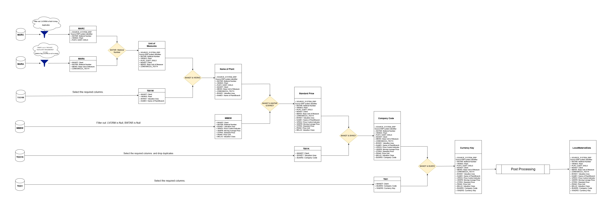
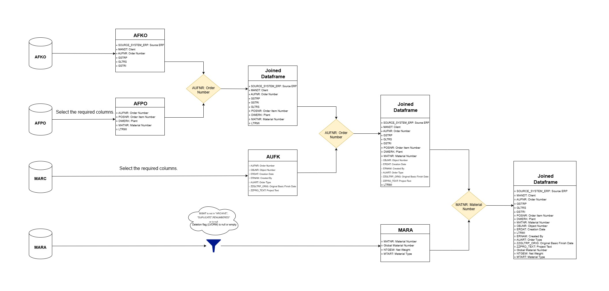

# ACE - Technical Case Study:

### Introduction
Congratulations and welcome to the technical boot camp for data engineers! In this exercise, you will practice data modeling
and coding in PySpark to build data products that provide insights into our supply chain. Your goal is to help us build a
connected world where everyone makes smart decisions and acts with impact. As a data engineer, your mission is to:

    ● Map real-world data into connected data products through business-driven data modeling.
    ● Support decision-making by creating a data model that depicts entities, events, alerts, and their relationships.
    ● Empower thousands of users to leverage insights and act with impact.

### Exercise Overview
You will work with data from two SAP systems that have similar data sources. Your task is to implement and integrate this data to provide a unified view for supply chain insights. The exercise involves:

    ● Processing Local Material data.
    ● Processing Process Order data.
    ● Ensuring both datasets have the same schema for harmonization across systems.
    ● Writing modular, reusable code with proper documentation.
    ● Following best-in-class principles for flexibility and maintainability.

### Architecture of Local Material Data



### Architecture of Process Order Data



## Project Setup and Execution Guide

### Step 1: Obtain the Project Files

1. Clone the project from the Git repository:
   ```bash
   git clone https://github.com/vinay07o/ace-use-case.git

 OR 2. If provided as a .zip file in an email, extract the files:

* Right-click the .zip file.
* Choose Extract All and select a destination folder.

### Step 2: Set Up the Environment
#### Pre-requisites

Ensure the following are installed:

* Java 17:
    ```bash
    java --version

* Python (compatible with PySpark).
* PySpark 3.5.3 installed via pip:
    ```bash
    pip install pyspark==3.3.2

* Hadoop winutils (Windows users only):
    * Download winutils.exe.
    * Place it in C:\hadoop\bin.

### Step 3: Configure the Project
1. Navigate to the project folder:
    ```bash
    cd ace-use-case

### Step 4: Setup Virtual Environment
* Create a vertual Environment
    ```bash
    make venv

* Activate the Virtual Environment
    ```bash
    venv\Scripts\activate

### Step 5: Execute Local material dataset from any system
* Get information on input parameter 
    ```bash
    local_material_run --help

* Pass input and output paths with master function
    ```bash
    local_material_run --data_dir ace/data/system_1 --system_name system_1 --output_dir output --file_name local_matrial_system_1

    local_material_run --data_dir ace/data/system_2 --system_name system_2 --output_dir output --file_name local_matrial_system_2

### Step 6: Execute process order dataset from any system
* Pass input and output paths with master function
    ```bash
    process_order_run --data_dir ace/data/system_1 --system_name system_1 --output_dir output --file_name process_order_system_1

    process_order_run --data_dir ace/data/system_2 --system_name system_2 --output_dir output --file_name process_order_system_2


### Step 7: If you want to union multiple system dataset use below command (optional)
* Pass any model different systems dataset
    ```bash
    union_datasets --data_path output/local_matrial_system_2.csv output/local_matrial_system_1.csv --output_dir output --file_name local_material

    union_datasets --data_path output/process_order_system_2.csv output/process_order_system_1.csv --output_dir output --file_name process_order

## Steps to run execute test cases and code coverage
```This step is not directly involved in generating the final output but is essential to ensure the project meets acceptance criteria. It verifies the functionality of the final product and evaluates code coverage, serving as a mandatory acceptance test for any data-driven products.```


* Run make test to validate the project and confirm that all utilities execute correctly without any errors (Optional).
    ```bash
    make test

* Run a code coverage analysis to verify if all logic branches in the code have been tested effectively (Optional)
    ```bash
    make coverage

* Run below command to get coverage report
    ```bash
    coverage report

* To check for missing lines in code coverage, run the following command
    ```bash
    make coverage-html

`The server starts at localhost:9999. Use this address to review each file and gather details about functions or logic segments that have not been tested. This step is crucial for identifying areas that require additional test coverage to ensure the robustness of the project.`

## Steps to Run Python Formatters
* Execute following coomand to format all python files of this project with PEP8 standards
    ```bash
    make format-python


## Contributor Guidelines for the Project

To maintain consistency, quality, and security within the project, contributors must adhere to the following instructions:

### 1. Project Directory Structure:
- Follow the predefined directory structure strictly.
- Ensure that files are placed in the appropriate folders as per their functionality (e.g., core logic, utilities, data scripts).

### 2. Separation of Concerns:
- Avoid embedding core logic within the main data-generating scripts.
- Core logic should be implemented as **reusable functions** or modules to encourage modularity and reusability.

### 3. Testing:
- All utility functions and core logic must be tested thoroughly.
- Ensure both logical accuracy and functionality through unit tests.

### 4. Code Coverage:
- Aim for **100% code coverage** in tests.
- Missing coverage lines should be tracked and resolved.

### 5. Documentation:
- Write comprehensive docstrings for all functions, modules, and classes to ensure clarity.
- Add inline comments to explain logic where necessary for readability.

### 6. Code Standards:
- Adhere to **PEP 8** standards for coding style and conventions.
- Use builtin setup like `make format-python` consistent formatting.

### 7. Automated Testing and Coverage:
- Ensure that the project integrates automated test execution and coverage checks.
- Validate that these safeguards are functioning to secure project quality.

By following these guidelines, the project ensures clean, maintainable, and scalable code while meeting security and quality benchmarks.


## Git commands for contributors
*   Clone any repository
    ```bash
    git clone <repository link>

*   Check branch
    ```bash
    git branch

*   Create branch
    ```bash
    git branch <branch name>

*   Switch to new branch
    ```bash
    git checkout <branch name>

*   Push new branch to repository
    ```bash
    git push --set-upstream origin <branch name>

*   Check file changes
    ```bash
    git status

*   Add file changes to work
    ```bash
    git add . / git add filename

*   Commit new changes
    ```bash
    git commit -m "commit comment"

*   Push changes to repository
    ```bash
    git push

*   pull changes from main branch before pushing or merging
    ```bash
    git pull
